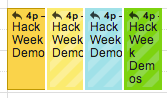
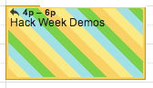
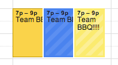
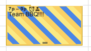

Google Multi-Calendar Event Merge
=========================

Chrome extension that visually merges the same event on multiple Google Calendars into one event.

 

 

Make this ^ . . . . . look like . . . . . . . this ^!
