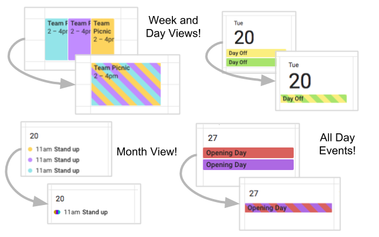

Google Multi-Calendar Event Merge
=========================

Chrome extension that visually merges the same event on multiple Google Calendars into one event.

### [Download from the Chrome Webstore](https://chrome.google.com/webstore/detail/event-merge-for-google-ca/idehaflielbgpaokehlhidbjlehlfcep) 
OR
### [Install with Greasemonkey](https://github.com/imightbeamy/gcal-multical-event-merge/raw/master/events.user.js)

## Classic UI

For refreance, [here's the last commit before changing to support the newer UI.](https://github.com/imightbeamy/gcal-multical-event-merge/blob/bed9a531157e14bf86463ea7970f8ce0ef76db1d/events.user.js)
